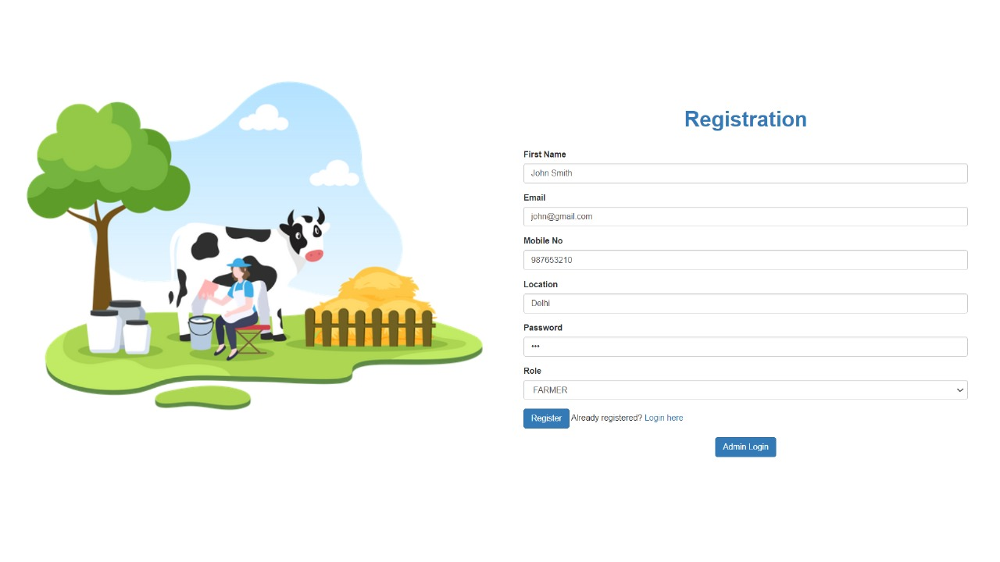
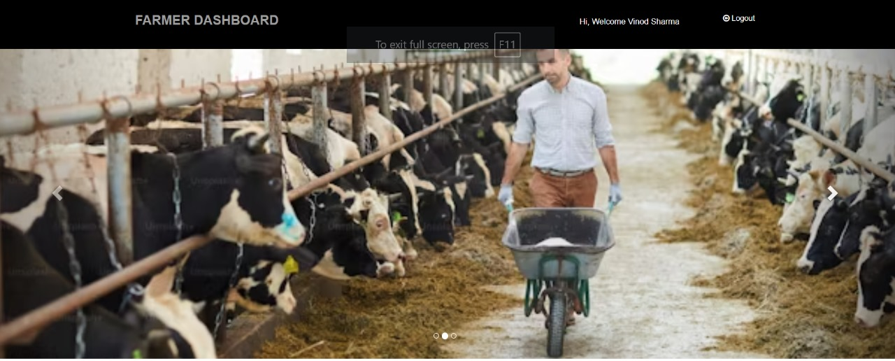
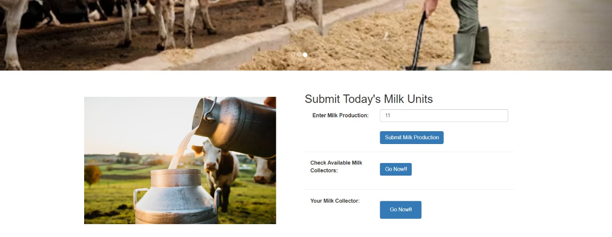
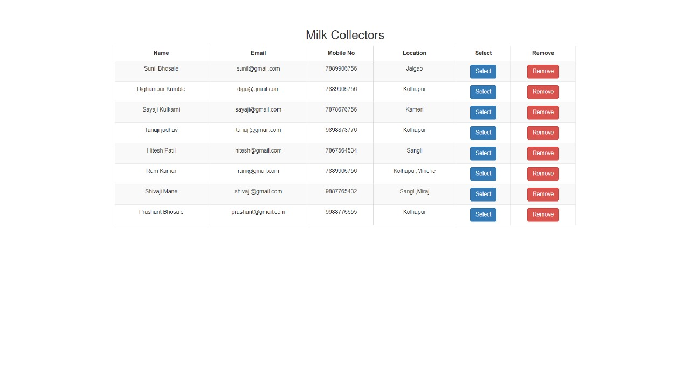
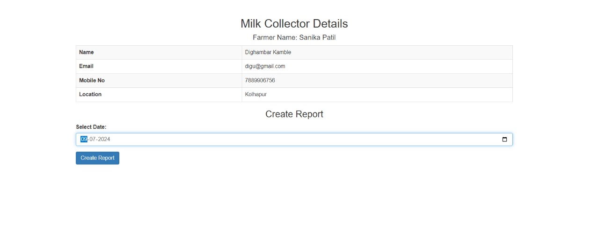
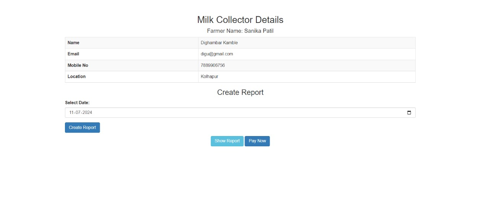
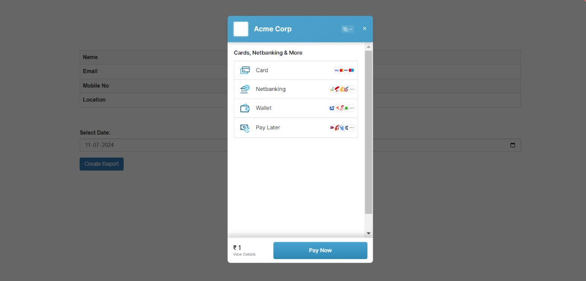
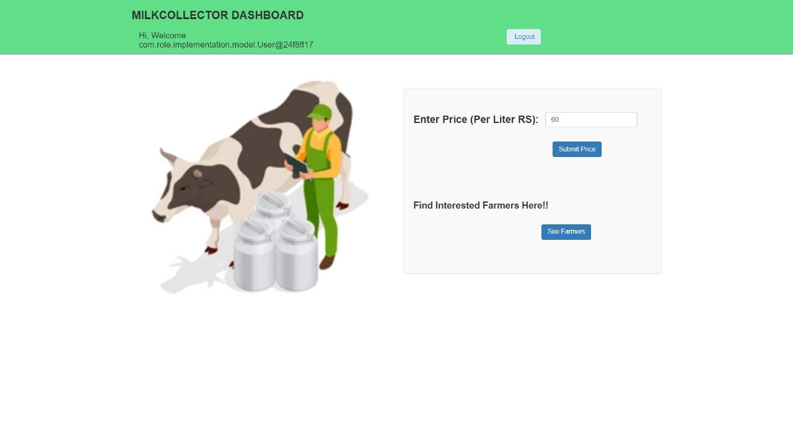
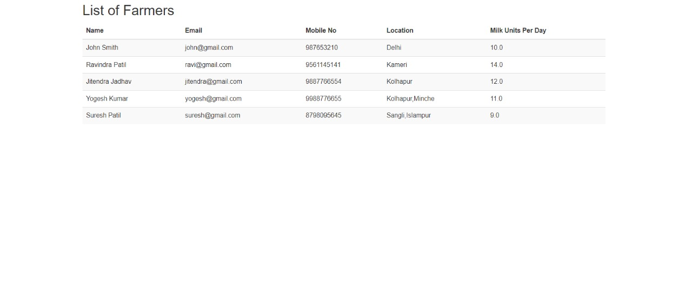

# Dairy-Connect

Dairy-Connect is a Java Spring Boot application aimed at revolutionizing farmer-milk collector transactions by facilitating seamless connections and efficient dealings.

## Table of Contents

- [Features](#features)
- [Tech Stack](#tech-stack)
- [Dependencies](#dependencies)
- [Screenshots](#screenshots)
- [Getting Started](#getting-started)
- [Usage](#usage)
- [Contributing](#contributing)
- [License](#license)

## Features

### Farmers

- Register and login
- View available milk collectors
- Choose specific milk collectors
- Update daily milk production
- View information of selected milk collector
- Generate daily milk reports
- Make payments to milk collectors

### Milk-Collectors

- Register and login
- Update milk unit rate
- View list of assigned farmers

## Tech Stack

### Frontend

- HTML
- CSS
- Bootstrap

### Backend

- Java
- Spring Boot

### Database

- PostgreSQL

## Dependencies

- Spring Data JPA
- Spring Security
- Thymeleaf
- Validation
- Spring Web
- Dev Tool
- PostgreSQL Connector
- PostgreSQL Driver

### External Tools

- RazorPay (for payments)
- JasperReports (for PDF generation)

## Getting Started

### Prerequisites

- JDK
- Maven
- PostgreSQL

### Installation

1. Clone the repository:
   ```
   git clone https://github.com/your/repository.git
   ```

2. Set up PostgreSQL database and update application.properties.

3. Build and run the application:
    ```
    mvn spring-boot:run
    ```

### Usage
    Access the application through your web browser.
    Register as a farmer or milk collector.
    Perform the desired actions based on your role.
    Contributing
    Contributions are welcome! Please fork the repository and submit a pull request.


## Screenshots














